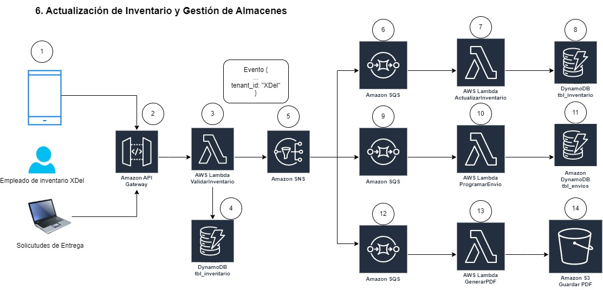
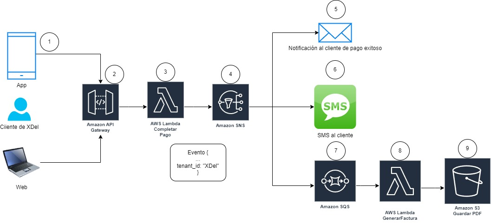

# Proyecto Final - Cloud Computing

Este repositorio contiene el desarrollo de una propuesta de solución técnica utilizando Cloud Computing en AWS para el equipo de TI de la empresa XDel Singapore. Nuestro enfoque es mejorar la eficiencia del procesamiento de eventos relevantes mediante una arquitectura basada en eventos y serverless, asegurando que la solución sea escalable y multi-tenancy, permitiendo su uso por diversas empresas.

## Proceso 6 - Actualización de Inventario y Gestión de Almacenes

1. Empleado de inventario XDel: un empleado de inventario de XDel utiliza un dispositivo (puede ser un móvil o un computador) para enviar solicitudes de entrega. La comunicación se realiza a través de HTTPS.
2. Amazon API Gateway: la solicitud de entrega enviada por el empleado es recibida por Amazon API Gateway, que actúa como el punto de entrada para todas las solicitudes, manejando la autenticación, autorización y validación de las mismas antes de dirigirlas a los servicios backend.
3. AWS Lambda (ValidarInventario): la solicitud es procesada por una función Lambda que valida el inventario. Esta función realiza la lógica de negocio necesaria para verificar la disponibilidad del inventario antes de continuar con el proceso.
4. DynamoDB (tbl_inventario): la función Lambda de validación de inventario interactúa con DynamoDB para acceder y actualizar la tabla de inventario. DynamoDB actúa como la base de datos NoSQL que almacena todos los detalles del inventario.
5. Amazon SNS: después de validar el inventario, la función Lambda publica un evento en Amazon SNS. Este evento es distribuido a varios suscriptores para continuar con el proceso de gestión de almacenes.
6. Amazon SQS: el evento publicado en Amazon SNS es recibido por una cola de Amazon SQS, que actúa como un buffer para almacenar y distribuir eventos antes de que sean procesados por funciones Lambda adicionales.
7. AWS Lambda (ActualizarInventario): una función Lambda procesa los eventos en la cola SQS para actualizar el inventario. Esta función se encarga de realizar las operaciones necesarias para ajustar el inventario en DynamoDB.
8. DynamoDB (tbl_inventario): la función Lambda de actualización de inventario interactúa nuevamente con DynamoDB para realizar los cambios necesarios en la tabla de inventario, asegurando que la información esté actualizada.
9. Amazon SQS: un segundo evento es enviado a otra cola de Amazon SQS para manejar la programación de envíos. Esta cola almacena los eventos hasta que una función Lambda pueda procesarlos.
10. AWS Lambda (ProgramarEnvio): una función Lambda procesa los eventos en la segunda cola SQS para programar los envíos. Esta función realiza la lógica de negocio necesaria para organizar y programar los envíos en el sistema.
11. DynamoDB (tbl_envios): la función Lambda de programación de envíos interactúa con DynamoDB para actualizar la tabla de envíos, asegurando que todos los envíos programados estén correctamente registrados.
12. Amazon SQS: un tercer evento es enviado a otra cola de Amazon SQS para manejar la generación de documentos PDF. Esta cola almacena los eventos hasta que una función Lambda pueda procesarlos.
13. AWS Lambda (GenerarPDF): una función Lambda procesa los eventos en la tercera cola SQS para generar documentos PDF relacionados con los envíos. Esta función se encarga de crear los documentos necesarios para la gestión de envíos.
14. Amazon S3 (Guardar PDF): la función Lambda de generación de PDF guarda los documentos PDF generados en Amazon S3. Amazon S3 actúa como un almacén de objetos que proporciona almacenamiento escalable y duradero para los documentos.

## Proceso 8 - Procesamiento de Pagos y Facturación

1. Cliente de XDel (App y Web): Los clientes de XDel utilizan una aplicación móvil o la página web para completar sus pagos.
2. Amazon API Gateway: Las solicitudes de pago de los clientes son recibidas por el API Gateway de AWS, que enruta las peticiones hacia los servicios correspondientes dentro de la arquitectura.
3. AWS Lambda - CompletarPago: Una función Lambda se activa para procesar el pago del cliente. Esta función verifica y completa la transacción de pago.
4. Amazon SNS: Una vez completado el pago, se envía una notificación a través de SNS para informar sobre el éxito de la transacción.
5. Notificación por Correo Electrónico: SNS distribuye una notificación por correo electrónico al cliente, confirmando que el pago se ha realizado con éxito.
6. SMS al Cliente: Además del correo electrónico, SNS también envía un mensaje SMS al cliente, confirmando la transacción exitosa.
7. Amazon SQS: La información del pago completado es enviada a una cola SQS, permitiendo el procesamiento asíncrono de la generación de facturas.
8. AWS Lambda - GenerarFactura: Una función Lambda se activa para generar la factura del pago realizado. Esta función toma la información del pago y crea un documento PDF de la factura.
9. Amazon S3 - Guardar PDF: El documento PDF de la factura generado por la función Lambda es almacenado en un bucket de S3 para su conservación y acceso futuro.

## Proceso 11 - Encuestas y Feedback, gestión de consultas y quejas de clientes

1. Cliente de XDel (App y Web): Los clientes de XDel interactúan con la aplicación móvil o la página web para enviar sus consultas, quejas o feedback.
2. Amazon API Gateway: Las solicitudes de los clientes son recibidas por el API Gateway de AWS, que se encarga de enrutar las peticiones hacia el servicio lambda de “ValidarEncuesta”.
3. AWS Lambda - ValidarEncuesta: Función Lambda para validar los datos de la encuesta o feedback enviado por el cliente. Esta validación asegura que la información sea completa y correcta antes de proceder. Se puede agregar validación del campo “tenant_id”.
4. Amazon SQS: Una vez validada, la información de la encuesta es enviada a una cola SQS para su procesamiento asíncrono. Esto permite manejar grandes volúmenes de solicitudes sin sobrecargar los sistemas.
5. AWS Lambda - ProcesarEncuesta: Función Lambda para procesar la información de la encuesta desde la cola SQS. Aquí se realizan operaciones adicionales como transformación de datos, limpieza y enriquecimiento de la información.
6. Amazon SNS: Después del procesamiento, los datos son enviados a un tema de SNS, que se encarga de distribuir los mensajes a los suscriptores interesados en esta información.
7. AWS Lambda - GenerarDocumento: Función Lambda para generar un documento basado en la información de la encuesta procesada. Este documento podría ser un reporte detallado de la consulta o queja del cliente.
8. Amazon S3: El documento generado es almacenado en un bucket de S3 para su conservación y acceso futuro.
9. Email a equipo de Marketing: El servicio SNS también envía notificaciones por correo electrónico al equipo de marketing, informándoles sobre la nueva encuesta o feedback recibido. Esto permite al equipo de marketing estar al tanto y actuar si es necesario.
10. AWS Lambda - DataEncuesta: Una función Lambda adicional procesa los datos de la encuesta para almacenarlos en una base de datos DynamoDB.
11. Amazon DynamoDB - tbl_encuestas: Finalmente, los datos de la encuesta son almacenados en una tabla DynamoDB para un acceso rápido y eficiente. Esto permite realizar análisis posteriores y generar reportes basados en las encuestas y feedback de los clientes.
