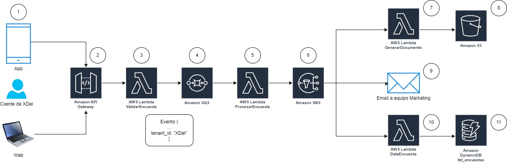

# Proyecto Final - Cloud Computing

Este repositorio contiene el desarrollo de una propuesta de solución técnica utilizando Cloud Computing en AWS para el equipo de TI de la empresa XDel Singapore. Nuestro enfoque es mejorar la eficiencia del procesamiento de eventos relevantes mediante una arquitectura basada en eventos y serverless, asegurando que la solución sea escalable y multi-tenancy, permitiendo su uso por diversas empresas.

## Proceso 6 - Actualización de Inventario y Gestión de Almacenes

## Proceso 8 - Procesamiento de Pagos y Facturación

## Proceso 11 - Encuestas y Feedback, gestión de consultas y quejas de clientes

1. Cliente de XDel (App y Web): Los clientes de XDel interactúan con la aplicación móvil o la página web para enviar sus consultas, quejas o feedback.
2. Amazon API Gateway: Las solicitudes de los clientes son recibidas por el API Gateway de AWS, que se encarga de enrutar las peticiones hacia el servicio lambda de “ValidarEncuesta”.
3. AWS Lambda - ValidarEncuesta: Función Lambda para validar los datos de la encuesta o feedback enviado por el cliente. Esta validación asegura que la información sea completa y correcta antes de proceder. Se puede agregar validación del campo “tenant_id”.
4. Amazon SQS: Una vez validada, la información de la encuesta es enviada a una cola SQS para su procesamiento asíncrono. Esto permite manejar grandes volúmenes de solicitudes sin sobrecargar los sistemas.
5. AWS Lambda - ProcesarEncuesta: Función Lambda para procesar la información de la encuesta desde la cola SQS. Aquí se realizan operaciones adicionales como transformación de datos, limpieza y enriquecimiento de la información.
6. Amazon SNS: Después del procesamiento, los datos son enviados a un tema de SNS, que se encarga de distribuir los mensajes a los suscriptores interesados en esta información.
7. AWS Lambda - GenerarDocumento: Función Lambda para generar un documento basado en la información de la encuesta procesada. Este documento podría ser un reporte detallado de la consulta o queja del cliente.
8. Amazon S3: El documento generado es almacenado en un bucket de S3 para su conservación y acceso futuro.
9. Email a equipo de Marketing: El servicio SNS también envía notificaciones por correo electrónico al equipo de marketing, informándoles sobre la nueva encuesta o feedback recibido. Esto permite al equipo de marketing estar al tanto y actuar si es necesario.
10. AWS Lambda - DataEncuesta: Una función Lambda adicional procesa los datos de la encuesta para almacenarlos en una base de datos DynamoDB.
11. Amazon DynamoDB - tbl_encuestas: Finalmente, los datos de la encuesta son almacenados en una tabla DynamoDB para un acceso rápido y eficiente. Esto permite realizar análisis posteriores y generar reportes basados en las encuestas y feedback de los clientes.
